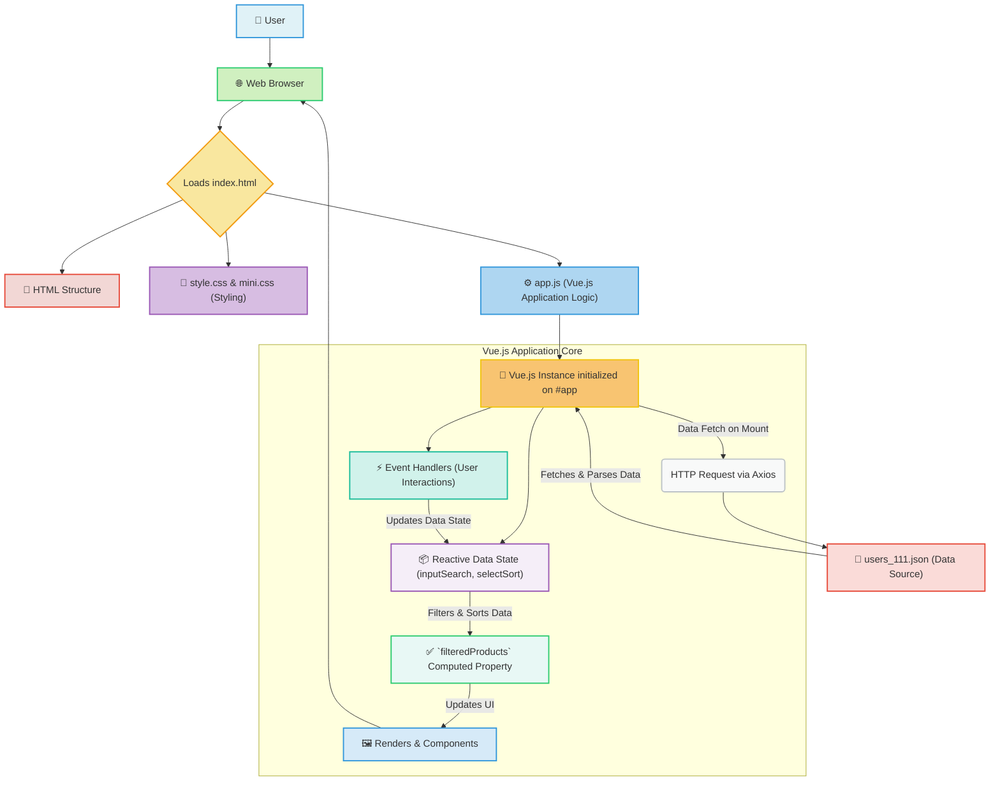

# 📊 Dynamic Data Table with Vue.js - `test_table_270819`

Welcome to `test_table_270819`, a responsive and interactive web application built with Vue.js, designed to efficiently display, search, and sort tabular data client-side. This project serves as a clear demonstration of fundamental front-end development principles, leveraging a lightweight and performant stack to create a dynamic user interface.

## 🚀 Features

This application offers a robust set of functionalities to manage and interact with tabular data:

*   **Dynamic Data Display**: Renders a comprehensive list of items (likely user profiles, given the data structure) in an organized and structured table format.
*   **Client-Side Search**: Empowers users to quickly locate specific records by performing a live search across "Name" and "Surname" fields via a dedicated input box. The table updates in real-time as the user types.
*   **Interactive Sorting**: Provides flexible data ordering capabilities. Users can sort the table content based on predefined rules (e.g., by ID, Name, Surname, Age, or Rating) using a convenient dropdown selector.
*   **Filter & Sort Reset**: A dedicated "Сброс" (Reset) button allows users to clear all active search queries and sorting parameters with a single click, reverting the table to its initial, unsorted, and unfiltered state.
*   **Responsive Design**: Built with `mini.css`, ensuring the user interface is clean, modern, and adapts gracefully across various screen sizes and devices.
*   **External Data Loading**: Fetches the tabular data asynchronously from a local `users_111.json` file using the Axios library, demonstrating best practices for handling static or API-sourced data.
*   **Vue.js Component-Based Architecture**: Leverages Vue's powerful reactive data binding and component system (`ProductItem` component for table rows) for efficient UI rendering, state management, and maintainable code.

## 🛠 Technology Stack

The application is built using a modern and efficient set of front-end technologies:

*   **Front-End Framework**: [**Vue.js v2**](https://vuejs.org/)
    *   A progressive JavaScript framework renowned for its approachability, performance, and versatility in building user interfaces. Utilized for reactive data binding, component management, and efficient DOM manipulation.
*   **HTTP Client**: [**Axios**](https://axios-http.com/)
    *   A popular promise-based HTTP client for the browser and Node.js. Used here to make asynchronous requests to fetch the `users_111.json` data.
*   **CSS Framework**: [**mini.css**](https://minicss.org/)
    *   A minimal, responsive, and style-agnostic CSS framework. It provides a lightweight foundation for styling, ensuring a clean and adaptive user interface with minimal overhead.
*   **Languages**:
    *   **HTML5**: The markup language for structuring the web content.
    *   **CSS3**: The stylesheet language for styling the web application.
    *   **Vanilla JavaScript (ES5/ES6+)**: The core programming language for implementing client-side logic and interacting with Vue.js.

## 🏗 Architecture / Workflow

The application follows a standard client-side architecture where the browser orchestrates the loading of HTML, CSS, and JavaScript, with Vue.js acting as the primary engine for data management and UI rendering.



**Workflow Explanation**:

1.  **User Access**: The user opens the web application in their browser.
2.  **Resource Loading**: The browser fetches `index.html`, which in turn links `style.css`, `mini.css`, and `app.js`.
3.  **Vue.js Initialization**: Once `app.js` is loaded, the Vue.js application instance is created and mounted onto the `<div id="app">` element in `index.html`.
4.  **Data Fetching**: Upon initialization, the Vue.js app uses **Axios** to asynchronously fetch the structured data from `users_111.json`.
5.  **State Management**: The application maintains its internal state, including the current `inputSearch` value, the selected `selectSort` rule, and the raw `products` data.
6.  **User Interaction**: Users interact with the input field (for search), the select dropdown (for sorting), and the "Reset" button. These interactions trigger Vue.js event handlers.
7.  **Reactive Updates**: Changes in the input field or select dropdown update the application's reactive data state.
8.  **Computed Properties**: Vue.js's `filteredProducts` computed property reactively processes the raw `products` data based on the current `inputSearch` and `selectSort` values, ensuring efficient data manipulation.
9.  **UI Rendering**: The `<table>` element, along with its dynamically generated `<ProductItem>` components (each representing a row), is reactively rendered based on the `filteredProducts` data. Any change in `filteredProducts` automatically updates the visible table.

## 📂 Project Structure

The repository is organized to clearly separate concerns, making it easy to navigate and understand:

*   `./`: The root directory of the project.
    *   `index.html`: The foundational HTML file that serves as the entry point for the web application. It pulls in all necessary CSS and JavaScript assets and defines the main structural elements (`<div id="app">`) for the Vue.js application.
    *   `style.css`: Contains custom CSS rules that complement or override styles provided by `mini.css`, allowing for project-specific visual adjustments.
    *   `app.js`: The heart of the application's logic. This JavaScript file contains the Vue.js instance, defining its data, methods, computed properties (for filtering and sorting), and components (such as `ProductItem` for table rows). It also handles the data fetching process using Axios.
    *   `users_111.json`: A static JSON file that acts as the primary data source for the application. It contains an array of objects, each representing an item or user with properties like `id`, `name`, `surname`, `age`, and `rating`.
    *   `README.md`: This comprehensive documentation file, providing details about the project, its features, architecture, and usage instructions.

## ⚙️ Installation / Quick Start

Getting `test_table_270819` up and running on your local machine is straightforward.

1.  **Clone the Repository**:
    Begin by cloning the project repository to your local system using Git:
    ```bash
    git clone https://github.com/iv150320/test_table_270819.git
    cd test_table_270819
    ```

2.  **Open in Browser (Simplest Method)**:
    Since this is a client-side application with all assets locally available, you can directly open the `index.html` file in your preferred web browser. Most modern browsers will render it correctly.
    *   Navigate to the cloned directory.
    *   Right-click on `index.html` and choose "Open with" -> your web browser (e.g., Chrome, Firefox, Edge).

3.  **Serve Locally (Recommended for Development)**:
    For a more robust development experience, especially if you encounter any browser security restrictions related to local file access (though unlikely with this setup), serving the application via a local HTTP server is recommended.

    *   **Install a Simple HTTP Server (if you don't have one)**:
        A popular and easy-to-use option is `serve` from npm. If you have Node.js and npm installed, you can install it globally:
        ```bash
        npm install -g serve
        ```

    *   **Run the Server**:
        Navigate to the project's root directory (`test_table_270819`) in your terminal and execute:
        ```bash
        serve .
        ```
        This command will start a local server, typically serving the application at `http://localhost:5000` (or a similar address). Open this URL in your web browser to view the application.